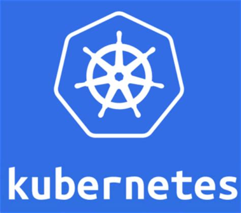
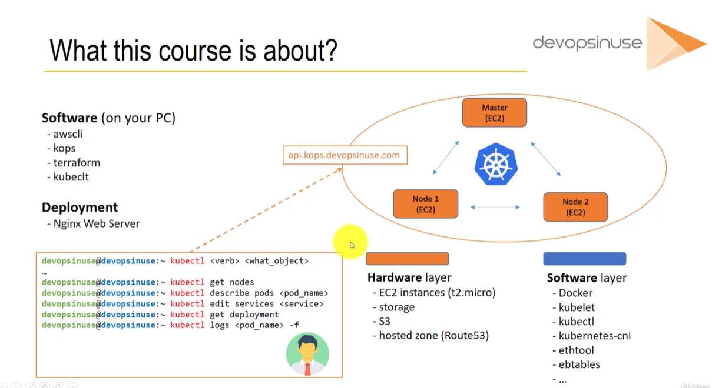
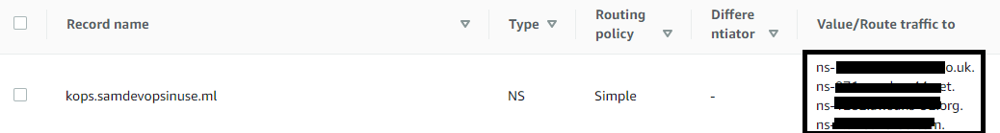

# Using Terraform to Deploy Kubernetes Cluster


- In this course we will be using **kops** and **Terraform** to deploy a **K8 cluster** of an **Nginx** Web Server.
- Kubectl will help us communicate with and control our kubernetes cluster.



## Terraform starter

- The `terraform.code.tf` file was created to specify the creation of a simple ec2 instance in our AWS specified region, and outputs the private ip of the created EC2 instance into a text file.
- a `terraform.tfvars` file was created and ignored from git which heald the following
```tfvars
AWS_ACCESS_KEY= "<your aws access key>"
AWS_SECRET_KEY= "<your aws secret key>"
```

## Kops
- To create the kubernetes cluster, we first need to create an S3 bucket to store the kubernetes congiguration in.
- We next need to purchase a domain name, (I chose a free one from https://my.freenom.com/) namely samdevopsinuse.ml.
- This needs to be created as a publically hosted zone in AWS Route53. The custom name servers shown in aws need to be entered into the domain name provider aswell.

- `kops.sh` file was created to create the cluster.
```bash
export AWS_ACCESS_KEY_ID=$(aws configure get aws_access_key_id)
export AWS_SECRET_ACCESS_KEY=$(aws configure get aws_secret_access_key)

kops create cluster \
# The name of our cluster
--name=kops.samdevopsinuse.ml \
# name of the s3 bucket made in AWS (kops storage)
--state=s3://kops.samdevopsinuse.ml \
# Role based authorisation
--authorization RBAC \
# Define data centre
--zones=eu-west-1b \
# Define number of nodes we will want
--node-count=2 \
# How mant Master nodes for this k8 cluster
--master-count=1 \
# ec2 instances power
--node-size=t2.micro \
--master-size=t2.micro \
# Hosted zone set up with Freenom
# Purchased sam.devopsinuse.ml for free
--dns-zone=kops.samdevopsinuse.ml \
# Make name of output folder where
# kops will generate terraform code
--out=samdevopsinuse_terraform \
# Target is "terraform" code
--target=terraform \
# Need to create ssh keypair for k8 clusters
--ssh-public-key=~/.ssh/samdevopsinuse.pub
```
- This can be ran in the terminal after `aws configure` is ran, with `bash kops.sh`

